# TriageIQ

**Which customer complaints will end up costing a company money?**

TriageIQ reads a new complaint, checks the company's track record, and estimates the chance that the
complaint ends with the company paying the customer. Risky complaints go to a senior analyst; the
rest get a standard reply.

> [!TIP]
> **Try it live: https://triageiq-mu.vercel.app** — score a complaint yourself (two examples are one click away),
> or open **Real 2024 complaints** to see the model's call next to what the company actually did, misses included.
> For developers: the API and its interactive docs are at **https://triageiq-mu.vercel.app/docs**.
> **The story behind it — [Finding the two percent](https://bajaj30.github.io/TriageIQ/)**, an illustrated essay.

> [!NOTE]
> **Status: core demo built and live (October 2026).** This is a learning project: the goal was to build every stage of a
> machine-learning product by hand, from a raw CSV to a public link. Similar-complaint retrieval remains **⏳** planned;
> optional explanations are being added behind a disabled-by-default validation gate and are not on the live site.

---

## At a glance

| | |
|---|---|
| 📨 **4.8 million** | real consumer complaints (2022–2024) |
| 🏢 **4,946** | companies complained about |
| 📅 **~4,400** | new complaints a day, across all companies |
| 💸 **1 in 80** | complaints end with the company paying money |
| 📝 **1 in 3** | complaints include the customer's own written story |
| 🎯 **81 / 100** | a simple starting model, on the most realistic test |
| 🤖 **82 / 100** | the fine-tuned AI model, on the same test |
| 💰 **$0** | out of pocket — a laptop, Kaggle's free GPU and free AWS credits |

---

## 1. The problem

In the US, anyone with a problem with a bank, lender or credit bureau can file a complaint with the
**Consumer Financial Protection Bureau (CFPB)**, a government agency. The CFPB sends it to the
company, which is expected to respond within **15 days**, and publishes the complaint in a public
database.

Every complaint is closed in one of a few ways. The one that matters most to the company is
**"Closed with monetary relief"** — the company paid money back: a refund, a reversed fee,
compensation.

So for every new complaint, a complaints team has to decide who handles it:

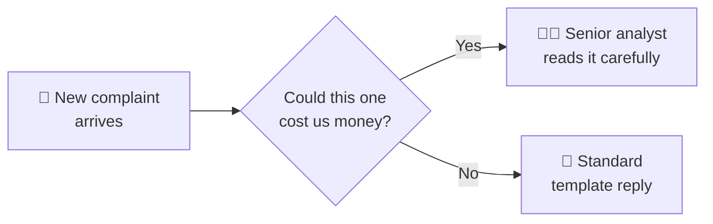

**TriageIQ answers the question in the middle.**

### Why that's hard

**1. It's a needle in a haystack.** Only about 1 in 80 complaints ends with a payout.

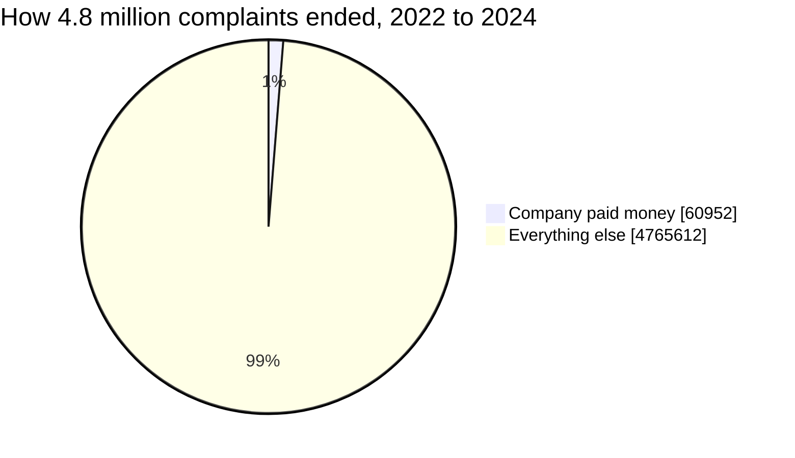

**2. The money is not where the complaints are.** Credit-report complaints are **83%** of everything
but only **3%** of the payouts. Credit cards and bank accounts are just **6%** of complaints but
**76%** of the payouts.

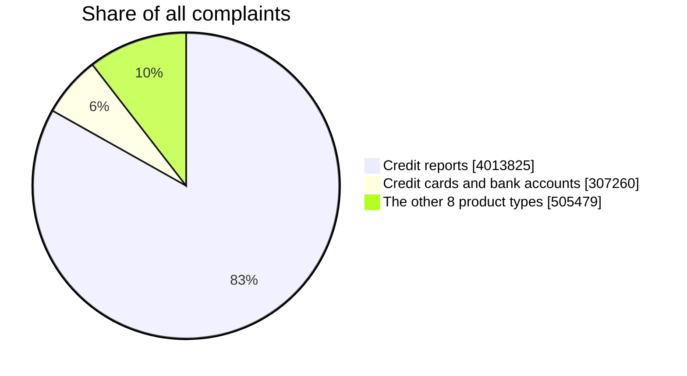

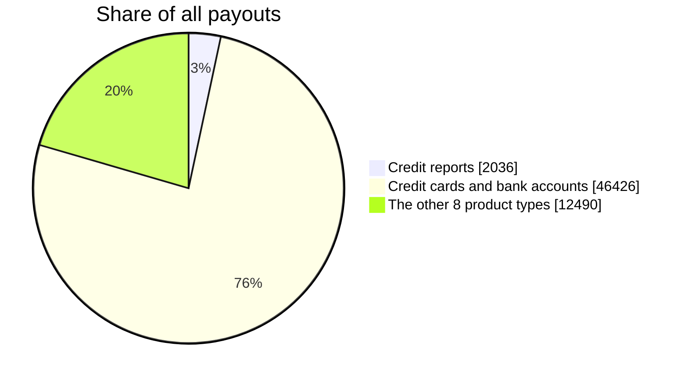

**3. Simple rules miss the expensive surprises.** "Send every credit-card complaint to a senior"
sounds sensible, but only about 1 in 7 of those pay out, so most of that senior time is wasted.
And rules ignore rare cases elsewhere. Picture a student-loan complaint about a $200,000 loan that
was never paid out: student-loan complaints pay out only about 1 in 90 times, so a product rule
would send it a template. Only reading the actual words catches it.

---

## 2. The idea — two readers, one score

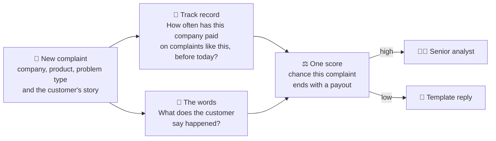

- **🧮 The track record** is built from all 4.8 million complaints in a database. For every company it
  works out, day by day, how often that company paid out on each kind of problem.
- **📝 The words** are read by an AI language model (DistilBERT, a smaller, faster version of Google's
  BERT), trained on how past complaints actually ended.
- **⚖️ One score** combines both. Neither is enough on its own — see the results below.

**What a complaints team gets back for each complaint:**

| | |
|---|---|
| Chance this complaint ends with a payout | a percentage — e.g. **31.7%** for a disputed overdraft fee |
| Suggested route | 👩‍💼 senior analyst, or 📄 template reply |
| Why the model gave that score | ⏳ optional XAI explanation; gated off until parity and server-resource checks pass |
| The 5 most similar past complaints | ⏳ of 5 ended with a payout *(planned, not built)* |

---

## 3. Playing fair — no peeking at the future

A model can look brilliant in testing if it accidentally sees the future — like a student who had the
answer key. TriageIQ follows one strict rule: **to score a complaint, use only what was known on the
day it arrived.**

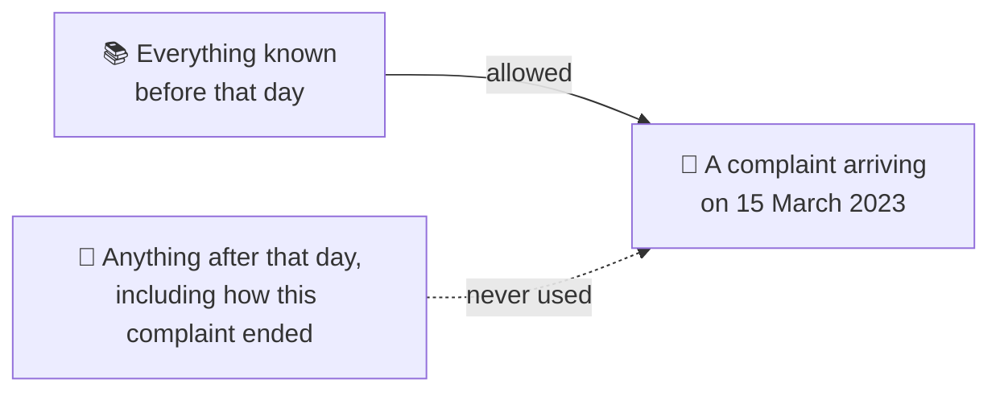

Two details make this harder than it sounds:

- **Companies take time to answer.** So the track record only counts complaints at least 60 days old —
  outcomes that would really be known by then.
- **Many complaints share a date.** On 43% of the days a company received complaints, it received more
  than one — once, 4,245 in a single day. "Before this complaint" needs a careful rule, or a
  complaint's own outcome leaks into its own score.

The model is also tested the way it will be used: **on complaints that come after the ones it learned
from.**

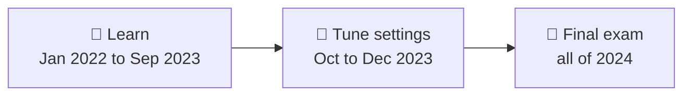

That matters, because payouts are getting rarer — among complaints with a written story, **2.7%** paid
out in 2022 but only **1.7%** in 2024. The final exam is harder than the lessons.

---

## 4. The data

**100% real and public:** the CFPB Consumer Complaint Database. Nothing is invented.

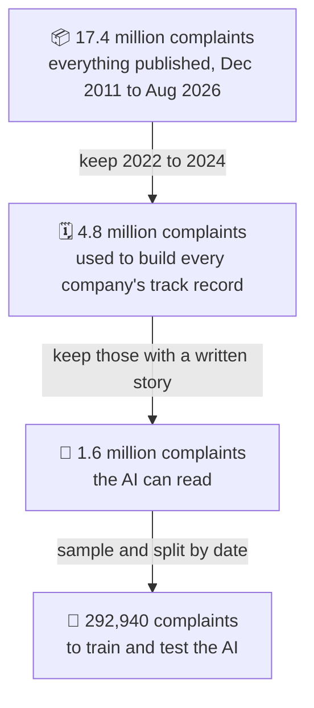

**Why keep the 3.2 million complaints that have no written story?** The AI can't read them, but they
hold **42% of all payouts**. Without them, every company's track record would be wrong — by a
different amount for each company.

**The categories changed halfway through.** In August 2023 the CFPB renamed and split some product
categories. Loaded as-is, a company's history would reset to zero overnight. A translation table fixes
this: 14 names become 11 consistent categories, and **1.3 million complaints** are re-labelled so their
history carries over. The same day, one of the most common *problem types* was renamed too — another
337,252 complaints re-labelled the same way. One product example:

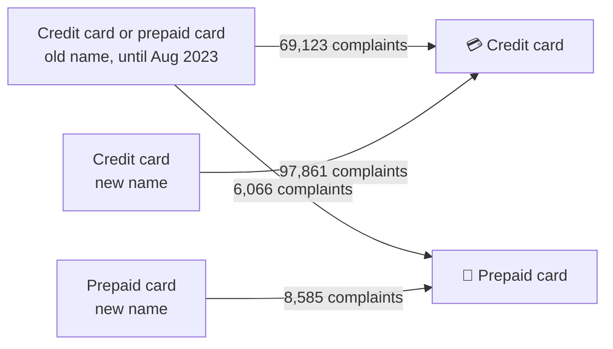

---

## 5. Under the hood — how the data is organised and how it flows

### The shape: a "snowflake"

One big table sits in the middle — **`fact_complaint`, one row per complaint**. Around it sit lookup
tables (companies, states, products, issues). Two of those have smaller tables branching off them
(sub-products, sub-issues) — arms branching out, like a snowflake. Two side tables hang off each
complaint: its **written story** (only when the customer published one) and its **timeline** — where
the "did it pay?" answer is kept, deliberately *away* from the main table, so it can never slip into the
model's inputs by accident.

**How to read it:** each box is a table — its name on top, its columns below. **PK** = the table's own
id; **FK** = a pointer to another table's id. On a line, the forked end means "many": one company has
many complaints. Dashed lines are the two translation tables that fix renamed categories.

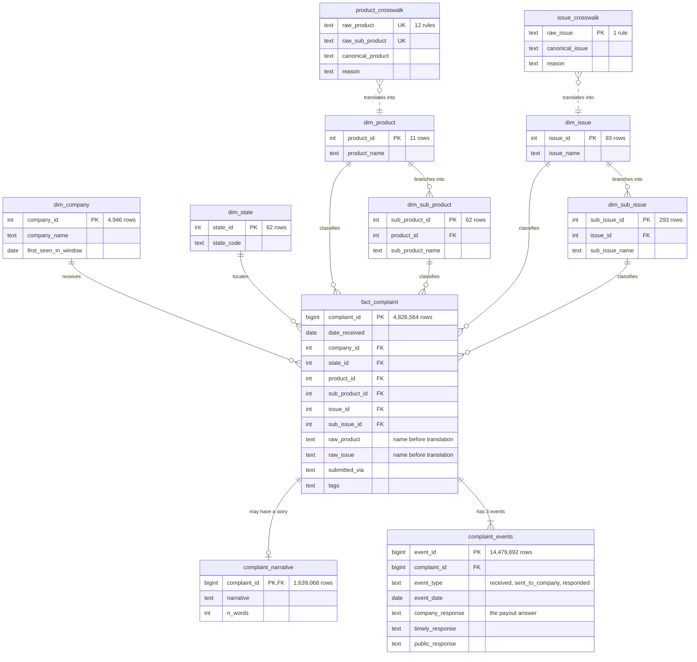

All numbers are for 2022–2024. Together the companies and issues form **31,378 company × problem
pairs** — each one gets its own track record.

### The journey: from a raw file to a score

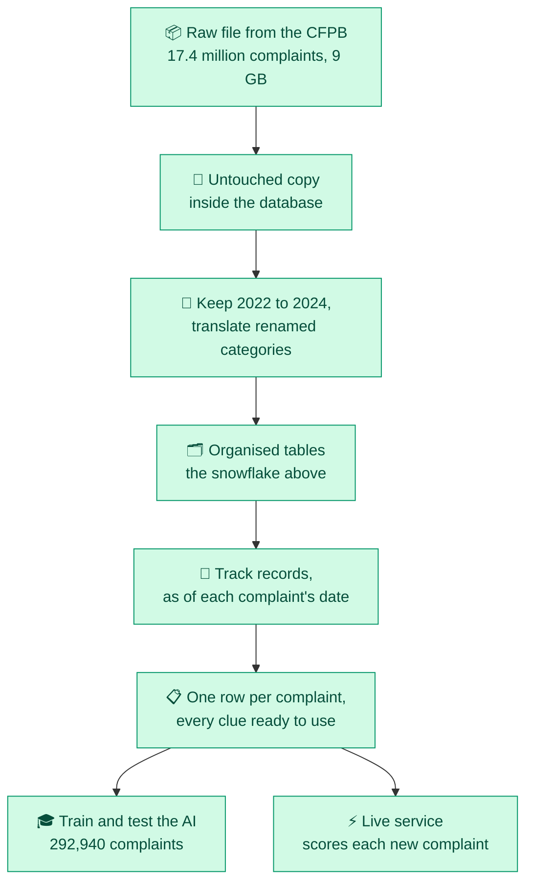

Training and the live service read **the same rows** — so the model is never tested on numbers
computed differently from the ones it learned from.

### How a track record is built — seven small steps

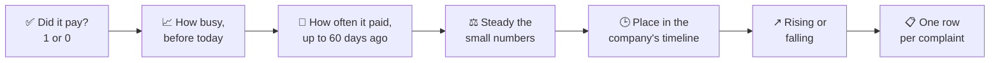

1. **Did it pay?** — every complaint gets a 1 or a 0. This is the answer the AI learns to predict.
2. **How busy** was this company, this problem type, the whole system — counting only days *before* today.
3. **How often it paid** — counting only complaints at least 60 days old, whose outcomes were really known.
4. **Steady the small numbers** — 1 payout in 3 complaints isn't a real "33% payer"; pull it toward its
   product's usual rate.
5. **Place in the timeline** — first complaint in months, or the 50th this month? A brand-new company?
6. **Rising or falling** — the last 90 days against the 90 before.
7. **One row per complaint** — every clue side by side, stored, ready for the AI and the live service.

---

## 6. Results

Every score below comes from **150,000 complaints from 2024** that the models never saw while learning.
Two models are compared: a **simple starting model** (word counts plus track record) — the bar to beat — and
the **final model**, an AI that reads the words, plus the track record.

**How to read the score:** take one complaint that ended with a payout and one that didn't. How often
does the model rank the payout one higher? **50 = a coin flip, 100 = perfect.**

We test the final model three ways, from easiest to most realistic:

```
Coin flip (no skill at all)            ██████████            50
Easy test      any two complaints      ███████████████████▍  97
Fair test      same product + problem  ██████████████████▉   95
Real-life test same company only       ████████████████▍     82
```

> [!IMPORTANT]
> **We treat the lowest number as the honest one.** A model earns easy points just by knowing that
> credit-card complaints pay out more often than credit-report complaints. That's true, but useless to a
> bank sorting its *own* complaints. The real-life test takes those easy points away.

**Words vs track record — which matters more?** *(the simple starting model)*

| test | 📝 words only | 🧮 track record only | ⚖️ both |
|---|:---:|:---:|:---:|
| Fair test (same product + problem) | 89 | 93 | **95** |
| Real-life test (same company only) | 80 | 75 | **81** |

Inside one company — the situation a real complaints team is in — **what the customer wrote matters
more than the history.** Together they do best.

**The final model vs the simple starting model:**

| | simple starting model | AI + track record |
|---|:---:|:---:|
| Real-life test score | 81 | **82** |
| Fair test score | 95 | **95** |
| Share of payouts caught if seniors read only the riskiest 10% | 92% | **93%** |
| Time to score one complaint | — | about 0.2 s typically, 0.8 s for the slowest 1 in 20 (the small cloud server) |

---

## 7. What changes for a complaints team

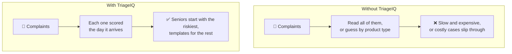

- **Senior time goes where money is at stake:** reading the riskiest **10%** of complaints catches **93%** of all payouts (2024 test, all companies together).
- **Fewer surprises:** rare but expensive cases inside "low-risk" products get flagged by their words.
- **Each score could come with examples:** the most similar past complaints and how they ended (⏳ planned, not built).
- **An explanation is being added separately:** it will describe how the model used the words and track-record inputs,
  not why the company actually paid. It stays off until the split ONNX graphs match the live model and pass server checks.

---

## 8. Where the project is

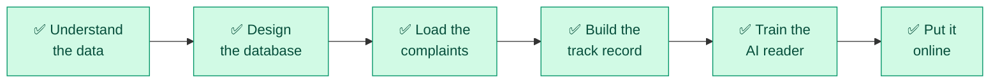

| step | status | what it produces |
|---|---|---|
| Understand the data | ✅ done | proof the complaints were written by real people; the training set |
| Design the database | ✅ done | 11 linked tables, with rules the database enforces itself |
| Load the complaints | ✅ done | 4.8M complaints, 1.6M stories, 14.5M timeline rows — 21 of 21 checks pass |
| Build the track record | ✅ done | 19 clues per complaint, stored for all 4.8 million complaints; the no-peeking test passed |
| Train the AI reader | ✅ done | the fine-tuned model and the scores above |
| Put it online | ✅ live | **https://triageiq-mu.vercel.app** — anyone can try it |

---

## 9. Honest limits

- **It predicts cost to the company, not harm to the customer.** The CFPB publishes no "how badly was
  this person hurt" label, so that can't be tested.
- **It knows *whether* money was paid, not *how much*.** Amounts aren't published.
- **The AI can only read about 1 in 3 complaints** — the ones whose writers chose to publish their story.
- **It decides who looks first, not how a complaint is resolved.** People still handle every complaint.
- **An explanation is not a cause.** If enabled after validation, attributions describe the model's use of words and
  history; hiding text can create an unusual story the model never saw during training.

---

<details>
<summary><b>🛠️ For the technically curious</b></summary>

### How it's built

```
visitor ─https─▶ Vercel (static site) ─forwards API paths + a secret header─▶ NGINX on AWS EC2
                                                                           (403 without the secret · 5 req/s per visitor)
                                                                                    │
                     FastAPI ◀──────────────────────────────────────────────────────┘
                       ├─ Postgres `serving` schema: the 19 track-record inputs as of 2025-01-01 (same SQL formulas
                       │  as training) + the text clean-up function + 150,000 real 2024 complaints for the demo
                       └─ ONNX Runtime on CPU: DistilBERT + the 19 inputs → logit → Platt calibration → senior / template
```

| part | tool | where |
|---|---|---|
| Database | PostgreSQL 16 + pgvector, Docker Compose (port 5433) — 4.8M complaints, snowflake schema, 16 GB | [`sql/00–02`](sql/) |
| Track record | SQL window functions, point-in-time ("as of" each complaint's date, outcomes ≥ 60 days old), smoothed toward the product rate (K = 5); materialized view `mv_features` → view `v_model_input` (19 inputs); recount + leak tests | [`sql/03_features/`](sql/03_features/), [`sql/tests/`](sql/tests/) |
| Training set | temporal split, case-control sampling on train only, one text = one split, `clean_narrative()` → Parquet | [`sql/04–05`](sql/), [`training/export_training_set.py`](training/export_training_set.py) |
| Text model | DistilBERT fine-tuned with the 19 inputs fused in (3 epochs, Kaggle's free T4) | [`training/fusion_distilbert.ipynb`](training/fusion_distilbert.ipynb) |
| Calibration | case-control offset −2.4165, then Platt scaling fitted on Jul–Dec 2024; senior if p ≥ 0.0367 (the riskiest 10%) | [`training/serving/calibrate.py`](training/serving/calibrate.py) |
| Packaging | ONNX export (no PyTorch at serving time) — matches PyTorch to 1e-5 | [`training/serving/export_onnx.py`](training/serving/export_onnx.py) |
| Serving features | `serving.model_input()` from an end-of-data snapshot — **skew test: 19/19 inputs identical** to training on 20,773 complaints | [`sql/06_serving/`](sql/06_serving/) |
| API | FastAPI: `POST /predict`, optional gated `POST /explain` (`/xai/status`), `GET /complaint/random`, `GET /complaint/{id}`, `/options/*`, `/model-info`, `/health` | [`api/`](api/) |
| Deployment | Docker Compose (db restored from a 57 MB dump + api + NGINX) on one EC2 t4g.small (ARM, Sydney), ≈ $21/month | [`deploy/`](deploy/) |
| Website | plain HTML/CSS/JS on Vercel | [`web/`](web/) |
| Essay | GitHub Pages | [`docs/`](docs/) |

**Design rules:** no leakage (every input computable at complaint receipt) · one source of truth for features
(all feature logic in SQL; training and serving use the same formulas, proven by the skew test) · temporal split,
never random · reproducible (SEED = 42, every quoted number has the code that made it).

**Explainability status:** the API/UI and split-graph exporter are implemented but disabled by default. The
non-git model bundle and training checkpoint are not present in this checkout, so parity and server latency/RAM
have not yet been measured. Do not enable or deploy explanations until `training/serving/export_xai_onnx.py`
passes its parity check on the Mac.

### Every model on the same exam

150,000 complaints from 2024 (3,471 payouts), never seen in training. Scores are ROC-AUC; the bracket is the 95%
range of the within-company score.

| model | reads | within company | within product × issue | pooled PR-AUC | riskiest 10% catches |
|---|---|---|---|---|---|
| TF-IDF + logistic regression | text | 0.7956 | 0.8916 | 0.3523 | 87.2% |
| TF-IDF + logistic regression | SQL features | 0.7500 | 0.9276 | 0.3645 | 88.8% |
| TF-IDF + logistic regression | text + SQL | 0.8115 | 0.9457 | 0.4262 | 91.7% |
| small network | SQL features | 0.7537 (0.744–0.763) | 0.9266 | 0.3847 | 89.1% |
| DistilBERT | text | 0.8036 (0.796–0.812) | 0.9163 | 0.3759 | 88.8% |
| **DistilBERT (shipped)** | **text + SQL** | **0.8224 (0.815–0.830)** | **0.9492** | **0.4395** | **92.6%** |

Pooled ROC-AUC of the shipped model: 0.9731. Adding dollar-amount features (data v4) gave 0.8195 (0.811–0.827) —
no better, so the simpler model shipped. Every number lives in [`Context/FACTS.md`](Context/FACTS.md).

**Speed** (300 real complaints): about 0.2 s typical / 0.8 s for the slowest 5% on the 2-core cloud server; 0.02 s /
0.08 s on an M4 laptop. The feature lookup takes under a millisecond — the model is nearly all of it.

### What's in this repo

| path | what's inside |
|---|---|
| [`sql/`](sql/) | the database pipeline, run in number order — every folder has a `log.md` |
| [`training/`](training/) | training notebook, evaluation, calibration and ONNX export; `results/` holds every measured score |
| [`api/`](api/) | the FastAPI service |
| [`deploy/`](deploy/) | Dockerfile, Compose file, NGINX config, server setup and deploy scripts |
| [`web/`](web/) | the website (Vercel) |
| [`docs/`](docs/) | the essay (GitHub Pages) |
| [`Context/`](Context/) | design docs: full spec, numbers, database decisions, interview notes, blog notes |
| [`Learning/`](Learning/) | study notes and interview revision cards, one folder per phase |
| [`NLP.md`](NLP.md) | every NLP / ML concept and metric used, and where |
| [`Data/`](Data/) | data exploration notebook and data profile (the raw CSV is not in git) |
| [`docker-compose.yml`](docker-compose.yml) | the full local database |

### Run it yourself

**The full pipeline** (rebuilds everything from the public data):
1. Install Docker Desktop.
2. Download the complaints CSV from the
   [CFPB Consumer Complaint Database](https://www.consumerfinance.gov/data-research/consumer-complaints/)
   and save it as `Data/complaints.csv` (about 9 GB).
3. Copy `.env.example` to `.env` and set `POSTGRES_PASSWORD`.
4. `docker compose up -d` — Postgres starts on `localhost:5433`.
5. Run the SQL files in each folder's `log.md` order: `sql/00_staging/` → `01_schema/` → `02_load/` →
   `03_features/` → `04_training_set/` → `05_export/` → `06_serving/` (pgAdmin's Query Tool, or
   `docker exec -i triageiq-postgres psql -U triageiq -d triageiq < sql/00_staging/01_load_raw.sql`).
   Each file ends with checks and the numbers to expect; `sql/tests/` re-checks the features by hand.
6. Train on Kaggle (`training/KAGGLE_SETUP.md`), then `training/serving/calibrate.py` and `export_onnx.py`.

**Just the service:** with the model bundle in `training/outputs/serving_v3/` (model files are too large for git),
`docker compose -f deploy/docker-compose.yml up -d --build` → http://localhost:8000/docs.

### Go deeper

| read | for |
|---|---|
| [Finding the two percent](https://bajaj30.github.io/TriageIQ/) | the whole story, for any reader |
| [`Context/WHAT_WHY.md`](Context/WHAT_WHY.md) | the pitch — what and why |
| [`Context/TriageIQ.md`](Context/TriageIQ.md) | the full engineering spec |
| [`Context/schema_explanation.md`](Context/schema_explanation.md) | every database decision, and why |
| [`Context/metrics.md`](Context/metrics.md) | how every score is defined and computed |
| [`NLP.md`](NLP.md) | every NLP / ML concept used |
| [`Context/interview.md`](Context/interview.md) | what broke, and how it was fixed |
| [`Context/blog_log.md`](Context/blog_log.md) | discarded ideas, surprises, lessons |

</details>
